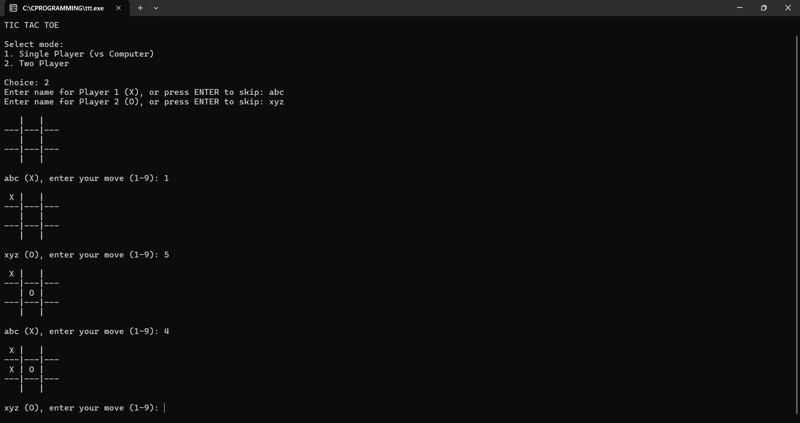

# Tic Tac Toe game in C

A simple command-line Tic Tac Toe game written in C with two modes:  
- Single Player (vs Computer AI)  
- Two Player (Human vs Human)

---

## Features

- Clean, user-friendly console interface  
- Play against a basic AI or a friend  
- Easy to run and understand  
- Enter custom player names in two-player mode  
- Validates input and handles invalid moves gracefully

---

## How to Play

1. Run the program.
2. Choose game mode:  
   - `1` for Single Player (play against AI)  
   - `2` for Two Player (play with a friend)  
3. If Two Player mode, enter player names or press Enter to use defaults.
4. Players take turns entering a number from 1 to 9 to place their mark (`X` or `O`):

---

## Screenshot

